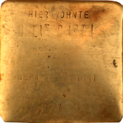

# Stolperstein App


<br />

A new Flutter project.

## Built With

- **Flutter Packages**
  - [camera](https://pub.dartlang.org/packages/camera)
  - [path_provider](https://pub.dartlang.org/packages/path_provider)
  - [url_launcher](https://pub.dartlang.org/packages/url_launcher)


## Getting Started

### Building from Source

Clone the repository

```bash
git clone https://github.com/Naskapie/stolperstein
cd Stolperstein
```

Run Stolperstein

```bash
flutter run
```