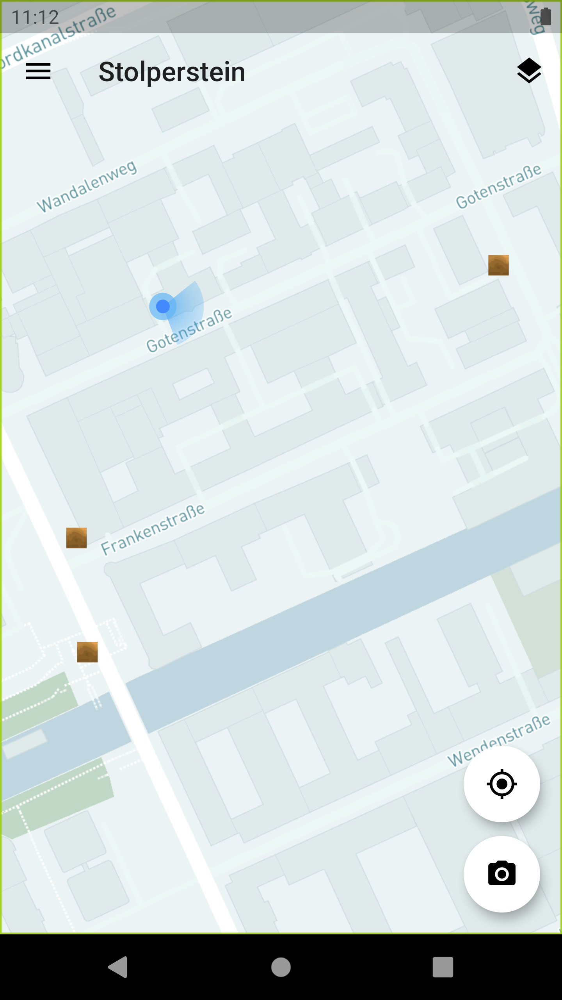
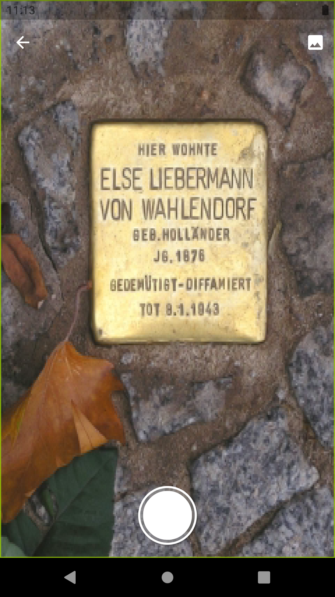
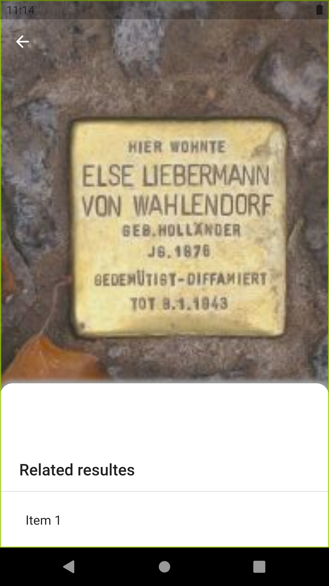
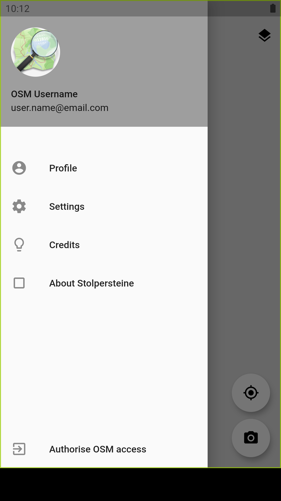

# Stolperstein App
[](https://flutter.dev/)
[](https://dart.dev/)
[](https://github.com/Naskapie/stolperstein/issues)
<!-- [](https://github.com/Naskapie/stolperstein/stargazers) -->
<!-- [](https://github.com/naskapie/stolperstein/blob/master/LICENSE) -->

<br />

Pattern Recognition App for the detection of "Stolpersteine"

## Screenshots

<table>
    <tr>
        <td></td>
        <td></td>
        <td></td>
        <td></td>
    </tr>
</table>


## Built With

- **Flutter Packages**
  - [camera](https://pub.dartlang.org/packages/camera)
  - [path_provider](https://pub.dartlang.org/packages/path_provider)
  - [url_launcher](https://pub.dartlang.org/packages/url_launcher)
  - [latlong](https://pub.dev/packages/latlong)
  - [flutter_map](https://pub.dev/packages/flutter_map)
  - [user_location](https://pub.dev/packages/user_location)

## Getting Started

### Building from Source

Clone the repository

```bash
git clone https://github.com/Naskapie/stolperstein
cd Stolperstein
```

Run Stolperstein

```bash
flutter run
```